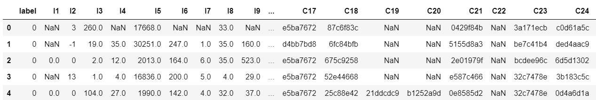
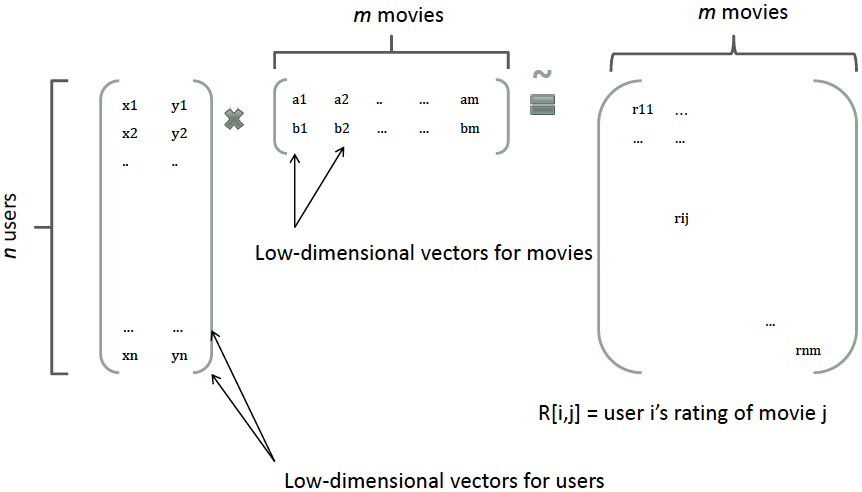
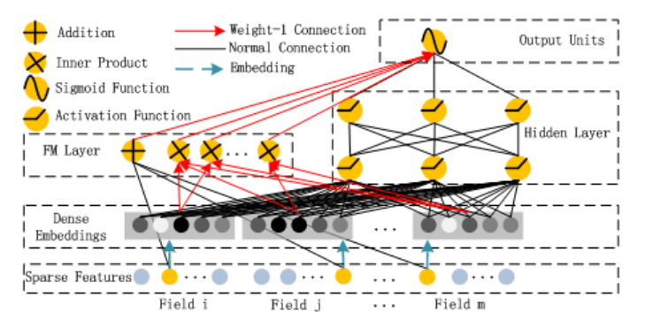
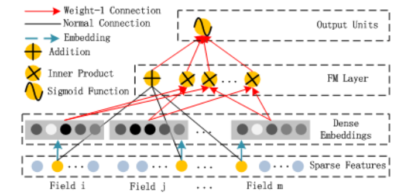
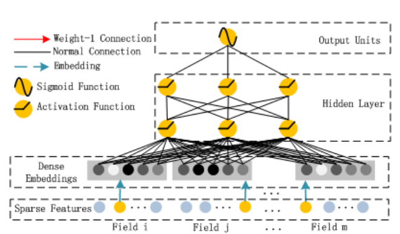

# <CENTER>推荐系统中的CTR(点击率)预估</CNETER>


## 1. 什么是CTR预估
### 1.1 背景
**点击率**(`Click Through Rate`， CTR):在搜索引擎中输入关键词后进行搜索，然后按竞价等因素把相关的网页按顺序进行排列出来，然后用户会选择自己感兴趣的网站点击进去；**把一个网站所有搜索出来的次数作为总次数，把用户点击并进入网站的次数占总次数的比例叫点击率。**

个性化的在线服务自从互联网诞生之时就出现了雏形，最近几年随着多媒体类互联网应用的兴起，电商平台商品推荐、广告精准投放、个性化搜索引擎等大量场景下会产生点击率预测的任务。由于用户的每一次点击行为都可以看作是其偏好的一种展示，**点击率预测就是从存储的用户历史数据中学习用户的偏好，然后用其预测未来行为的过程。**

我们常常看的抖音，快手，淘宝，在这些公司中，点击率预估很重要很重要的一个模块。因为好的推荐是直接与收益挂钩的。
<center></center>
<!--  -->

### 1.2 具体任务
因为CTR抽象出来就两种情况，点或者不点，所以可以看为是一个**二分类任务**。会被组织为表格的形式，每一行对应一条数据，每一列则为一个用户或商品特征项，所有的训练数据首先会经过特征工程模块，对数值特征进行归一化、离散化、哈希、索引等预处理，之后每一条数据都会变为仅仅包含标准特征的多维向量，其中标签列为 0 或 1（0 代表用户没有点击行为，1 代表有点击行为），一组数据的展示如下图:
<!--  -->
<center></center>

由于标签为 0 或 1, 评价指标为`Logloss`或者`AUC`，关于评价指标的具体内容不再赘述。同学们可以自行去了解。

CTR的数据特征一般CTR数据的特征一般可以分为三大类：**用户的特征**、**广告的特征**和**上下文特征**。
- **用户特征** 包括用户性别、年龄、职业、教育水平等等

- **广告特征**包括广告的行业(旅游、电商，……)、标签等等；
- **上下文特征**包括广告的位置、用户使用的设备、浏览器、时间、地点等。

这些特征有一部分是连续的值，比如年龄；而更多的特征是Category(类别)的特征，比如性别为两类的男女，职业可以是销售、产品经理、……。所以点击率预估的一个很重要的部分就是如何表征这些类别特征，让模型学到更多的信息。

## 2. CTR(点击率)预估中的经典模型
### 2.1 FM(Factorization Machines)
在FM模型之前，CTR预估最常用的模型是SVM和LR(包括用GBDT给它们提取非线性特征)。SVM和LR都是线性的模型(SVM理论上可以引入核函数从而引入非线性，但是由于非常高维的稀疏特征向量使得它很容易过拟合，因此实际很少用)，但是实际的这些特征是有相关性的。比如根据论文[DeepFM: A Factorization-Machine based Neural Network for CTR Prediction](https://www.ijcai.org/proceedings/2017/0239.pdf)的调研，在主流的app应用市场里，在吃饭的时间点食谱类app的下载量明显会比平时更大，因此app的类别和时间会存在二阶的关系。另外一个例子是年轻男性更喜欢射击类游戏，这是年龄、性别和游戏类别的三阶关系。**因此怎么建模二阶、三阶甚至更高阶的非线性的关系是预估能够更加准确的关键点。**

我们可以直接建模二阶关系：

$$y(\mathbf{x}) = w_0+ \sum_{i=1}^n w_i x_i + \sum_{i=1}^n \sum_{j=i+1}^n w_{ij} x_i x_j\tag{1}$$

其中，n是特征向量的维度，$x_i$是第i维特征，$w_0、w_i、w_{ij}$是模型参数。这种方法的问题是二阶关系的参数个数是$n(n−1)/2$，这样会导致模型的参数很多，另外因为特征向量非常稀疏，二次项参数的训练是很困难的。其原因是，每个参数$w_{ij}$的训练需要大量$x_i$和$x_j$都非零的样本；由于样本数据本来就比较稀疏，满足“$x_i$和$x_j$都非零”的样本将会非常少。训练样本的不足，很容易导致参数 $w_{ij}$ 不准确，最终将严重影响模型的性能。

那么，如何解决二次项参数的训练问题呢？矩阵分解提供了一种解决思路。根据[《Factorization Machines 10-805 class talk》](http://www.cs.cmu.edu/~wcohen/10-605/2015-guest-lecture/FM.pdf)在model-based的协同过滤中，一个rating矩阵可以分解为user矩阵和item矩阵，每个user和item都可以采用一个隐向量表示。比如在下图中的例子中，我们把每个user表示成一个二维向量，同时把每个item表示成一个二维向量，两个向量的点积就是矩阵中user对item的打分。
<!--  -->
<center></center>

类似地，所有二次项参数 $w_{ij}$  可以组成一个对称阵$\mathbf{W}$（为了方便说明FM的由来，对角元素可以设置为正实数），那么这个矩阵就可以分解为 $\mathbf{W} = \mathbf{V}^T \mathbf{V}$，$\mathbf{V}$ 的第j列便是第j维特征的隐向量。换句话说，每个参数 $w_{ij} = \langle \mathbf{v}_i, \mathbf{v}_j \rangle$，这就是FM模型的核心思想。因此，FM的模型方程为（本文不讨论FM的高阶形式）

$$y(\mathbf{x}) = w_0+ \sum_{i=1}^n w_i x_i + \sum_{i=1}^n \sum_{j=i+1}^n \langle \mathbf{v}_i, \mathbf{v}_j \rangle x_i x_j\tag{2}$$
其中，$\mathbf{v}_i$ 是第 $i$ 维特征的隐向量，$\langle\cdot, \cdot\rangle$ 代表向量点积。隐向量的长度为 $k(k«n)$，包含 k 个描述特征的因子。根据公式(2)，二次项的参数数量减少为 $kn$ 个，远少于多项式模型的参数数量。另外，参数因子化使 $x_hx_i$ 的参数和 $x_ix_j$ 的参数不再是相互独立的，因此我们可以在样本稀疏的情况下相对合理地估计FM的二次项参数。具体来说，$x_hx_i$ 和 $x_ix_j$ 的系数分别为 $\langle \mathbf{v}_h, \mathbf{v}_i \rangle$ 和 $\langle \mathbf{v}_i, \mathbf{v}_j \rangle$，它们之间有共同项 $v_i$。也就是说，所有包含“$x_i$ 的非零组合特征”（存在某个 $j≠i$，使得 $x_ix_j≠0$）的样本都可以用来学习隐向量 $v_i$，这很大程度上避免了数据稀疏性造成的影响。而在多项式模型中，$w_{hi}$ 和 $w_{ij}$ 是相互独立的。

直观上看，FM的复杂度是 $O(kn^2)$。但是，通过下式，FM的二次项可以化简，其复杂度可以优化到 $O(kn^2)$。由此可见，FM可以在线性时间对新样本作出预测。

$$\sum_{i=1}^n \sum_{j=i+1}^n \langle \mathbf{v}_i, \mathbf{v}_j \rangle x_i x_j = \frac{1}{2} \sum_{f=1}^k \left(\left( \sum_{i=1}^n v_{i, f} x_i \right)^2 - \sum_{i=1}^n v_{i, f}^2 x_i^2 \right)\tag{3}$$
下面是上式的推导过程，可以跳过。
$$\begin{split}
& \sum_{i=1}^n \sum_{j=i+1}^n \langle \mathbf{v}_i, \mathbf{v}_j \rangle x_i x_j \\
= & \frac{1}{2} \sum_{i=1}^n \sum_{j=1}^n \langle \mathbf{v}_i, \mathbf{v}_j \rangle x_i x_j - \frac{1}{2} \sum_{i=1}^n \langle \mathbf{v}_i, \mathbf{v}_i \rangle x_i x_i \\
= & \frac{1}{2} \left(  \sum_{i=1}^n \sum_{j=1}^n \sum_{f=1}^k v_{if}v_{jf} x_i x_j - \sum_{i=1}^n \sum_{f=1}^k v_{if}v_{if} x_i x_i \right) \\
= & \frac{1}{2} \sum_{f=1}^k \left( \left(\sum_{i=1}^n v_{if}x_i \right) \left( \sum_{j=1}^n v_{jf}x_j \right) -\sum_{i=1}^n v_{i,f}^2x_i^2 \right) \\
= & \frac{1}{2} \sum_{f=1}^k \left( \left(\sum_{i=1}^n v_{if}x_i \right)^2 -\sum_{i=1}^n v_{i,f}^2x_i^2\right)
\end{split}$$
训练的时候可以使用随机梯度下降算法，梯度计算公式为：
$$\frac{\partial}{\partial\theta} \hat{y} (\mathbf{x}) = \begin{cases} 
1, & \text{if }\theta \text{ is }w_0 \\
x_i, & \text{if } \theta \text{ is } x_i \\
x_i \sum_{j=1}^nv_{j,f}x_j-v_{i,f}x_i^2 , & \text{if } \theta \text{ is } v_{i,f}
\end{cases}$$

对于FM和FFM模型，感兴趣的同学可以去看美团技术团队分享的文章[深入FFM原理与实践](https://tech.meituan.com/2016/03/03/deep-understanding-of-ffm-principles-and-practices.html),这部分内容也是主要参考了他们的文档。

Carnegie Mellon University关于FM的PPT[《Factorization Machines 10-805 class talk》](http://www.cs.cmu.edu/~wcohen/10-605/2015-guest-lecture/FM.pdf)。


### 2.2 DeepFM
#### 概述
像LR/SVM这样的模型无法建模非线性的特征交互(interaction)，我们只能人工组特征的交叉或者组合，人工是昂贵的，人力去做特征成本太高了，而且很对复杂的特征交互难以发现。需要进行大量的数据分析来发现。

FM通过给每个特征引入一个低维稠密的隐向量来减少二阶特征交互的参数个数，同时实现信息共享，使得在非常稀疏的特征向量上的学习更加容易泛化。理论上FM可以建模二阶以上的特征交互，但是由于计算量急剧增加，实际一般只用二阶的模型。

神经网络的优势就是可以多层的网络结构更好的进行特征表示，从而学习高阶的非线性关系。**DeepFM的思想就是结合FM在一阶和二阶特征的简洁高效和深度学习在高阶特征交互上的优势，同时通过共享FM和DNN的Embedding来减少参数量和共享信息，从而得到更好的模型。**

#### 模型简介
DeepFM包括FM和DNN两个部分，最终的预测由两部分输出的相加得到：
$$\hat{y}=sigmoid(y_{FM}+y_{DNN})$$
其中yFM是FM模型的输出，而yDNN是DNN的输出。模型的结构如下图所示，它包含FM和DNN两个组件。
<!--  -->
<center></center>


我们分别来看这两个组件：
<!--  -->
<center></center>

这里是FM组件，它的的公式就是：
$$y_{FM}=\langle w, x \rangle + \sum_{i=1}^d \sum_{j=i+1}^d \langle V_i, V_j \rangle x_i \cdot x_j$$
FM模型不单可以建模1阶特征，还可以通过隐向量点积的方法高效的获得2阶特征表示，即使交叉特征在数据集中非常稀疏甚至是从来没出现过。


<!--  -->
<center></center>

这个是DNN组件，可以看到就是输入特征通过Embedding之后输入到隐藏层然后得到输出，很简单的网络结构。


## 3. CTR (点击率)预估实战
### 3.1 工具介绍
这里我们进行CTR预估，使用的是浅梦大佬开源的的DeepCTR-torch的工具包，上面介绍那么多，在这个工具包里面都有实现，是一个易于使用、模块化和可扩展的深度学习CTR模型库。这里附上Github地址[DeepCTR-torch](https://github.com/shenweichen/DeepCTR-Torch)。
安装也十分简单
```python
 pip install -U deepctr-torch
```
除了DeepFM，DeepCTR还包括更多更新的模型，本次就只介绍DeepFM，下面是完整的模型列表：
|                 Model                  | Paper                                                                                                                                                           |
| :------------------------------------: | :-------------------------------------------------------------------------------------------------------------------------------------------------------------- |
|  Convolutional Click Prediction Model  | [CIKM 2015][A Convolutional Click Prediction Model](http://ir.ia.ac.cn/bitstream/173211/12337/1/A%20Convolutional%20Click%20Prediction%20Model.pdf)             |
| Factorization-supported Neural Network | [ECIR 2016][Deep Learning over Multi-field Categorical Data: A Case Study on User Response Prediction](https://arxiv.org/pdf/1601.02376.pdf)                    |
|      Product-based Neural Network      | [ICDM 2016][Product-based neural networks for user response prediction](https://arxiv.org/pdf/1611.00144.pdf)                                                   |
|              Wide & Deep               | [DLRS 2016][Wide & Deep Learning for Recommender Systems](https://arxiv.org/pdf/1606.07792.pdf)                                                                 |
|                 DeepFM                 | [IJCAI 2017][DeepFM: A Factorization-Machine based Neural Network for CTR Prediction](http://www.ijcai.org/proceedings/2017/0239.pdf)                           |
|        Piece-wise Linear Model         | [arxiv 2017][Learning Piece-wise Linear Models from Large Scale Data for Ad Click Prediction](https://arxiv.org/abs/1704.05194)                                 |
|          Deep & Cross Network          | [ADKDD 2017][Deep & Cross Network for Ad Click Predictions](https://arxiv.org/abs/1708.05123)                                                                   |
|   Attentional Factorization Machine    | [IJCAI 2017][Attentional Factorization Machines: Learning the Weight of Feature Interactions via Attention Networks](http://www.ijcai.org/proceedings/2017/435) |
|      Neural Factorization Machine      | [SIGIR 2017][Neural Factorization Machines for Sparse Predictive Analytics](https://arxiv.org/pdf/1708.05027.pdf)                                               |
|                xDeepFM                 | [KDD 2018][xDeepFM: Combining Explicit and Implicit Feature Interactions for Recommender Systems](https://arxiv.org/pdf/1803.05170.pdf)                         |
|         Deep Interest Network          | [KDD 2018][Deep Interest Network for Click-Through Rate Prediction](https://arxiv.org/pdf/1706.06978.pdf)                                                       |
|    Deep Interest Evolution Network     | [AAAI 2019][Deep Interest Evolution Network for Click-Through Rate Prediction](https://arxiv.org/pdf/1809.03672.pdf)                                            |
|                AutoInt                 | [CIKM 2019][AutoInt: Automatic Feature Interaction Learning via Self-Attentive Neural Networks](https://arxiv.org/abs/1810.11921)                              |
|                  ONN                   | [arxiv 2019][Operation-aware Neural Networks for User Response Prediction](https://arxiv.org/pdf/1904.12579.pdf)                                                |
|                FiBiNET                 | [RecSys 2019][FiBiNET: Combining Feature Importance and Bilinear feature Interaction for Click-Through Rate Prediction](https://arxiv.org/pdf/1905.09433.pdf)   |
|                IFM                 | [IJCAI 2019][An Input-aware Factorization Machine for Sparse Prediction](https://www.ijcai.org/Proceedings/2019/0203.pdf)   |
|                DCN V2                    | [arxiv 2020][DCN V2: Improved Deep & Cross Network and Practical Lessons for Web-scale Learning to Rank Systems](https://arxiv.org/abs/2008.13535)   |
|                DIFM                 | [IJCAI 2020][A Dual Input-aware Factorization Machine for CTR Prediction](https://www.ijcai.org/Proceedings/2020/0434.pdf)   |
|                AFN                 | [AAAI 2020][Adaptive Factorization Network: Learning Adaptive-Order Feature Interactions](https://arxiv.org/pdf/1909.03276)   |
### 3.2 四步实现简单CTR预估
#### Step 1:导入模型
```python
import pandas as pd
import torch
from sklearn.metrics import log_loss, roc_auc_score
from sklearn.model_selection import train_test_split
from sklearn.preprocessing import LabelEncoder, MinMaxScaler

from deepctr_torch.inputs import SparseFeat, DenseFeat, get_feature_names

data = pd.read_csv('./criteo_sample.txt')

sparse_features = ['C' + str(i) for i in range(1, 27)]
dense_features = ['I' + str(i) for i in range(1, 14)]

data[sparse_features] = data[sparse_features].fillna('-1', )
data[dense_features] = data[dense_features].fillna(0, )
target = ['label']
```
#### Step 2:简单的预处理
通常用简单的方法来编码用于嵌入的稀疏分类特征
- LabelEncoder:将特征映射到整数值从 0 ~ len(unique) - 1
```py
for feat in sparse_features:
    lbe = LabelEncoder()
    data[feat] = lbe.fit_transform(data[feat])
```
- TargetEncoder, HashEncoder等一些方法在此不再介绍。

而对于密集的数值特征，它们通常被离散化为桶，这里我们使用归一化.
```py
mms = MinMaxScaler(feature_range=(0,1))
data[dense_features] = mms.fit_transform(data[dense_features])
```
#### Step 3:生成特征列

对于稀疏特征，我们通过嵌入技术将它们转换为密集向量。对于密集的数值特征，我们将它们连接到全连接层的输入张量。
- 标签编码
```py
fixlen_feature_columns = [SparseFeat(feat, vocabulary_size=data[feat].nunique(),embedding_dim=4)
                       for i,feat in enumerate(sparse_features)] + [DenseFeat(feat, 1,)
                      for feat in dense_features]
```
- 生成特征列

```
dnn_feature_columns = sparse_feature_columns + dense_feature_columns
linear_feature_columns = sparse_feature_columns + dense_feature_columns

feature_names = get_feature_names(linear_feature_columns + dnn_feature_columns)
```


#### Step 4:生成训练样本并训练模型
```py
train, test = train_test_split(data, test_size=0.2)
train_model_input = {name:train[name] for name in feature_names}

test_model_input = {name:test[name] for name in feature_names}


device = 'cpu'
use_cuda = True
if use_cuda and torch.cuda.is_available():
    print('cuda ready...')
    device = 'cuda:0'

model = DeepFM(linear_feature_columns,dnn_feature_columns,task='binary',device=device)
model.compile("adam", "binary_crossentropy",
              metrics=['binary_crossentropy'], )

history = model.fit(train_model_input,train[target].values,batch_size=256,epochs=10,verbose=2,validation_split=0.2)
pred_ans = model.predict(test_model_input, batch_size=256)
```

## 4. 推荐系统学习心得和资源推荐
推荐系统是个发展了很多年的问题了，现在仍然在发展，而且随着深度学习的发展，推荐系统的技术也发生了大的变革，比如现在很火的基于序列和自然语言处理的推荐。因为现在收集到的用户喜爱偏好数据，不仅仅只是简单的表格数据，可能是语音，文本，甚至视频等。现在基于图神经网络的推荐系统也是很火热的。多任务的点击率预估也是很火爆的一个方向。
我也是今年刚接触推荐系统，今天上半年的微信大数据挑战赛考察的内容就是多任务的点击率预估。当时太菜了，而且事情好忙，没有去认真做，没有进复赛，感觉很可惜的。
这是当时冠军队伍的答辩PPT封面
<center></center>

这个比赛开源出前七名的答辩PPT,我专门整理了一下，有时间就去学一学，看看大佬们对问题的理解和解决问题的思路，也是收获不少的。而且这个比赛，github上开源的代码也很多，也是一些很好的学习资源。
[优秀队伍答辩PPT 提取码：1234](https://pan.baidu.com/s/1UlXhsrQ9haDIsDRnKriHWA )

后来暑假讯飞的基于用户画像的商品推荐挑战赛，是个基于序列的推荐。当时前期是投入了大量的时间和精力去做，和同济大学的一个研究生，腾讯广告部分的算法工程师，重邮的一个研究生还有本校的一个同学组了一个队伍。学到了很多，也是算是入了推荐系统的门。但是也很可惜，当时代码能力不够，很多idea没有去尝试。现在是不是会想，如果当时再强一点，可能站上领奖台的就是我们了。不过虽然没有能拿到奖项，但是结交了一群朋友，有不懂的问题可以和他们一起讨论讨论嘛。

<center></center>


后来又参加了一个推荐的比赛，58科技主办的招聘是58同城的核心业务之一，企业可以在58平台上发布职位，用户可以在平台上浏览职位，浏览完后若对该职位有求职意向可以进一步投递自己的简历，企业收到求职者的简历后便可开展后续招聘流程，如简历审核、发起面试等。在58招聘推荐系统中，如何提高用户对职位的点击（浏览）率和转化（投递）率至关重要。是个多任务的推荐。通过这次比赛，是好好学习了一下多任务推荐的模型，比如MMOE。
现在这个比赛已经长期开放为训练赛了，感兴趣的同学可以去试一试。
<center></center>

[58比赛连接](https://tech.58.com/game/introduction?contestId=4)

目前还有一个正在进行的推荐系统的比赛，爱奇艺主办的预测用户的留存的比赛，预测用户留存是个充满挑战的难题：不同用户本身的偏好、活跃度差异很大，另外用户可支配的娱乐时间、热门内容的流行趋势等其他因素，也有很强的周期性特征。这个比赛也是大佬云集，而且比赛产出可以直接转化为论文。所以我下半学期准备投入去做这个比赛，可能结果也不是很好，但是能学到东西就不是坏事。感兴趣的同学也可以去做一下，说不定大奖就是你的了。
<center></center>

[爱奇艺用户留存比赛连接](http://challenge.ai.iqiyi.com/detail?raceId=61600f6cef1b65639cd5eaa6)

说了一些推荐系统相关的比赛，再来分享一些学习资源。
首先就是各个模型的论文，上面那个表格里面都有，可以去阅读一下对模型理解的深刻了，应用起来才会有随心所欲的感觉。
然后推荐几篇文章吧。
[万字入门推荐系统](https://mp.weixin.qq.com/s/aaOosZ57qJpIU6cma820Xw)
[一文了解点击率预估（CTR）建模](https://mp.weixin.qq.com/s?__biz=MzA4NTUxNTE4Ng==&mid=2247507228&idx=1&sn=f97413f439ae6ad1e9f3d9ac20474060&chksm=9fd453c1a8a3dad77651794194f6b485927ebad6b2f348dd076b3dd9b114698fc3947651614e&scene=21#wechat_redirect)
等等还有一些入门推荐系统的好文，可以关注一下这两个公众号。
对于机器学习和深度学习基础，推荐《统计学习方法》和《深度学习》(花书)这两本书。看完并能对公式进行推导，就基本上打下一个坚实的基础。也可以参考吴恩达或者李宏毅的视频来学习，效果更好。


### 参考文章：
>[1] https://zhuanlan.zhihu.com/p/376611028
[2] https://zhuanlan.zhihu.com/p/55752344
[3] https://lufor129.medium.com/%E8%BC%95%E8%AE%80%E8%AB%96%E6%96%87-%E4%BA%8C-deepfm-a-factorization-machine-based-neural-network-for-ctr-prediction-9de74b8772ab
[4] DeepFM: A Factorization-Machine based Neural Network for CTR Prediction
[5] https://github.com/shenweichen/DeepCTR-Torch


- **Writer:** 王宇浩
- **Date:** 2021-11-11